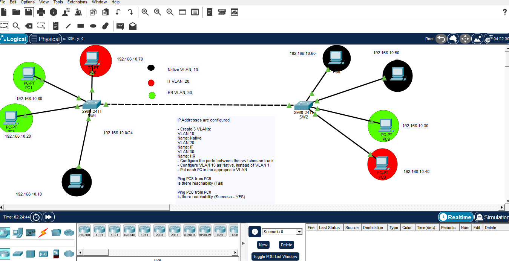

# Cisco Packet Tracer: VLAN Segmentation, Trunking, and Native VLAN Mismatch Lab

## 📌 Project Overview
This laboratory experiment demonstrates the configuration, verification, and troubleshooting of **VLANs**, **802.1Q Trunking**, and **Native VLAN** modification
using Cisco Catalyst 2960 switches. 

A key highlight of this lab is the intentional creation and successful troubleshooting of a **Native VLAN Mismatch** error,
showcasing how Cisco IOS protocols (CDP and Spanning Tree) react to configuration inconsistencies to protect the network.

## 🗺️ Network Topology


---

## ⚙️ Lab Requirements & Tasks

1. **IP Addressing:** All hosts are pre-configured within the `192.168.10.0/24` subnet.
2. **VLAN Creation & Naming:**
   * **VLAN 10:** Name: `native`
   * **VLAN 20:** Name: `IT`
   * **VLAN 30:** Name: `HR`
3. **Trunk Configuration:** Configure the inter-switch links between `SW1` (Fa0/1) and `SW2` (Fa0/1) as an 802.1Q Trunk line.
4. **Native VLAN Modification:** Change the default Native VLAN from VLAN 1 to **VLAN 10** on both switches.
5. **Access Port Assignment:** Assign each PC to its designated color-coded VLAN:
   * **Black Hosts:** Native VLAN 10
   * **Red Hosts:** IT VLAN 20
   * **Green Hosts:** HR VLAN 30

---

## 🔍 Step-by-Step Configuration & Real-Time Troubleshooting

### 1. SW1 Trunk & Native VLAN Configuration
Initially, `Fa0/1` on `SW1` was operating in `dynamic auto` mode. The interface was manually forced into Trunk mode, and the native VLAN was changed to 10:

```text
SW1# configure terminal
SW1(config)# interface fa0/1
SW1(config-if)# switchport mode trunk
SW1(config-if)# switchport trunk native vlan 10
2. The Native VLAN Mismatch Dilemma
Immediately after configuring SW1, because SW2 was still using the default Native VLAN 1,
 Cisco IOS security and discovery mechanisms generated the following critical warning messages:

CDP Alert: Discovered the native VLAN inconsistency between the peer switches.

Plaintext
%CDP-4-NATIVE_VLAN_MISMATCH: Native VLAN mismatch discovered on FastEthernet0/1 (10), with SW2 FastEthernet0/1 (1).
Spanning Tree Protocol (STP) Protection: To prevent accidental Layer 2 traffic leaking and loops,
 Spanning Tree Protocol (STP) detected the inconsistent Port VLAN ID (PVID) and safely blocked the interface:

Plaintext
%SPANTREE-2-RECV_PVID_ERR: Received BPDU with inconsistent peer vlan id 1 on FastEthernet0/1 VLAN10.
%SPANTREE-2-BLOCK_PVID_LOCAL: Blocking FastEthernet0/1 on VLAN0010. Inconsistent local vlan.
3. SW2 VLAN and Trunk Rectification
To resolve the blockage, SW2 was configured to mirror the VLAN database and trunk definitions. Fa0/1 was set to trunk mode, and its native VLAN was matched to 10:

Plaintext
SW2# configure terminal
SW2(config)# vlan 10
SW2(config-vlan)# name native
SW2(config)# vlan 20
SW2(config-vlan)# name IT
SW2(config)# vlan 30
SW2(config-vlan)# name HR
SW2(config)# interface fa0/1
SW2(config-if)# switchport mode trunk
SW2(config-if)# switchport trunk native vlan 10
4. Resolution & Port Restoration
As soon as the Native VLAN settings matched on both sides of the link,
STP validated the consistency and automatically unblocked the interfaces, restoring full network convergence:

Plaintext
%SPANTREE-2-UNBLOCK_CONSIST_PORT: Unblocking FastEthernet0/1 on VLAN0001. Port consistency restored.
%SPANTREE-2-UNBLOCK_CONSIST_PORT: Unblocking FastEthernet0/1 on VLAN0010. Port consistency restored.
📊 Verification & Connectivity Analysis
Verification Commands Executed
show vlan brief: Verified that all access ports were properly assigned.

show interface fa0/1 switchport: Confirmed that Administrative Mode and Operational Mode are both set to trunk with Trunking Native Mode VLAN: 10 (native).

End-to-End Testing Results
Scenario A: Ping PC8 from PC9

Result: FAIL (No Reachability)

Technical Reason: PC9 belongs to HR VLAN 30, and PC8 belongs to IT VLAN 20. Since they are located in different broadcast domains
 and there is no Layer 3 routing device implementing Inter-VLAN routing, traffic cannot cross the VLAN boundary.

Scenario B: Ping PC8 from PC0

Result: SUCCESS (Reachability? YES)

Technical Reason: Both hosts share IT VLAN 20. When PC0 transmits a frame, SW1 tags it with an 802.1Q header for VLAN 20, safely sends it across the verified Trunk link,
 and SW2 delivers it to PC8 after removing the tag.

🚀 How to Use This Repository
Download the VLAN.pkt file.

Open it inside Cisco Packet Tracer.

Access the CLI of either switch and run show interfaces trunk or show vlan brief to analyze the validated operational state.# Cisco-VLAN-Trunking-Lab
A Cisco Packet Tracer lab implementing VLAN segmentation, 802.1Q trunking, and troubleshooting a Native VLAN mismatch using CDP and Spanning Tree Protocol (STP) logs.
